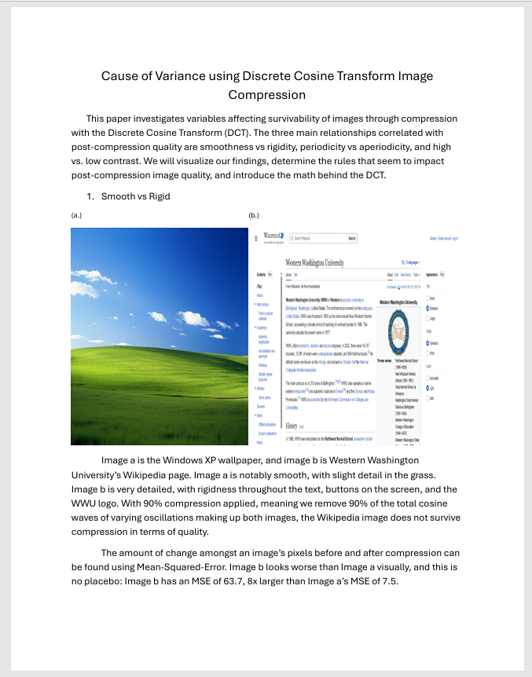

# Cause-of-Variance-using-Discrete-Cosine-Transform-Image-Compression
This paper investigates variables affecting survivability of images through compression with the Discrete Cosine Transform (DCT). The three main relationships correlated with post-compression quality are smoothness vs rigidity, periodicity vs aperiodicity, and high vs. low contrast. We will visualize our findings, determine the rules that seem to impact post-compression image quality, and introduce the math behind the DCT.

